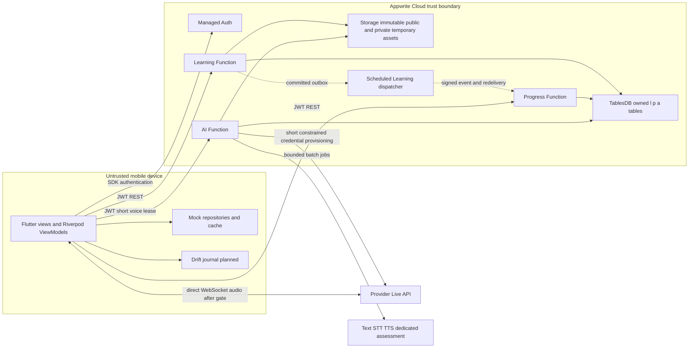

# Architecture freeze report — 2026-10-09–10

**Verdict: preserve the architecture; conditional integration readiness.** Flutter Android/iOS + manual Riverpod MVVM; three independently packaged TypeScript/Node22 Learning/Progress/AI services; Appwrite Auth/TablesDB/Storage; REST/OpenAPI; owner-only writes; Learning outbox/Progress inbox-ledger; planned Drift journal. Existing mock UI and identifiers retained. Appwrite managed infrastructure is not a fourth custom service. Independent artifacts/deploy descriptors/tests now exist locally; real cloud revisions and coursework rubric acceptance remain unproven.

## What changed from V1

[Audit changelog](audit/CHANGELOG.md) records operational corrections without rewriting existing UI. Node22 is publicly supported by Cloud; actual account needs a probe. Education enforcement and legacy Live retirement require dated action. Current candidate model profiles replace old design defaults but remain disabled until benchmark. Mock draft/XP/speaking behavior is labeled against server contracts. Latest TypeScript7 proved incompatible; compatible tooling is pinned. Billing design, state/content/control contracts and runnable safe scaffold are supplied. [Manifest](audit/DOCS_MANIFEST.md) maps requested content to one canonical owner each.

Cloud boxes are design/deployment targets, not deployed resources. Local entrypoints only serve health/degraded state and fail closed for business routes; mock workflow ports never enter Function bundles.

## Adversarial role review

| Role | Finding / correction / acceptance gate |
|---|---|
| Principal | Keep three deploy boundaries; no broker/gateway/unused profile/social service. Function count/rubric may block cloud topology; B01/B02. |
| Flutter | Actual router in main.dart; retain mock DI. In-memory lesson draft and missing Drift mean kill/offline proof pending; P5/P10. |
| Backend/data | No client XP/time authority; transaction/outbox + own inbox/ledger. Keys give logical isolation only; real conflict/row permission tests B03. |
| AI/realtime | Single-use constrained credential is not hard spend guarantee. Legacy model earliest retirement dated; no maintained Dart Live SDK assumed; B04/B05. |
| Platform | Windows source/tests/web and Android debug compilation pass. Default global-cache Android build failed; fresh Gradle user home passed. Licenses/device and iOS proof remain unresolved; B06. |
| QA | 39 FR/19 NFR/42 spec screens/37 table owners/94 schemas preserve IDs. 422 callback declarations inventoried; semantic/device state acceptance still P2–P10. |
| Security | Auth via Account.get, no mobile secrets, fail-closed scaffold. HMAC/entitlement/cross-account/live token misuse not implied by local tests. |
| Cost | Four usage scenarios and expiration fallback; no free quota, balance or zero-spend guarantee. B02/B07 require actual dashboards/admission. |

This review uses main-thread role checks plus isolated official voice verification; no fiction of eight independent human sign-offs. [Open decisions](audit/OPEN_DECISIONS.md) names owners, deadlines/probes/fallbacks. Realtime/cloud integration remains required coursework proof until an actual rubric or explicit accepted scope change says otherwise.

## Evidence and limits

[Validation receipt](audit/VALIDATION.md) records commands actually executed. Successful specification/contract checks do not certify an app/device/cloud build. Design budgets (NFR latency/frame/RSS/reward convergence, AI seconds, restore RPO/RTO and cost ceilings) remain labeled targets until measured. No paid plan, credentials, deployment, publish, merge, reset, deletion or force-push occurred. Final diff is incremental and mobile source/lock is preserved.

Immediate next tasks: finish P1-FOUND-001 tooling/device proof; P1-FOUND-002 actual JWT/runtime/transaction adapters; P1-CONTRACT-001 Dart DTO round-trips; P1-OPS-001 full schema/seed/permissions/cloud CI; P2-DES-001 remaining accessibility/golden contract gates. Safe parallel lanes follow [DAG](agent/DEPENDENCY_DAG.md); root contracts, router, locks and migrations have one owner. Full phase gates remain pending.
