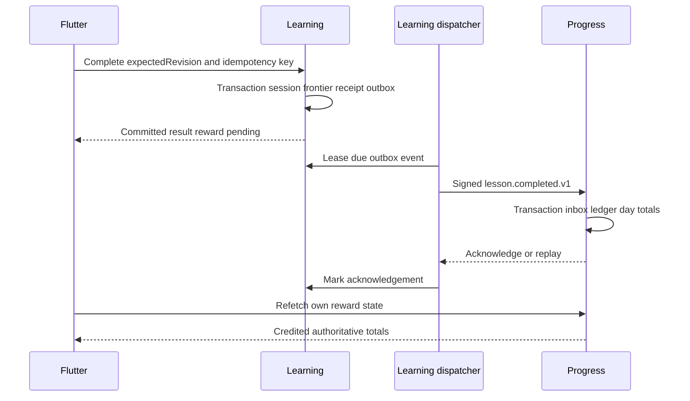

# Authority, transactions and cross-service delivery

Canonical [storage](../data/DATA_MODEL.md), [events](../api/EVENTS_ERRORS.md), [auth](../api/AUTH.md) and [offline protocol](OFFLINE.md) remain unchanged. One database saves platform resources; service-owned tables and signed commands are logical boundaries, not hard per-project key isolation.

Learning owns content/frontier/session/regrade/completion/outbox; Progress owns profile/XP/streak/review projections/social/entitlements; AI owns usage/leases/jobs/temporary audio. Only the owner writes its prefix. Transport/shared code contains no grading/reward model. Independent package/artifact/function/revision/tests distinguish genuine deploy boundaries; cloud integration and the teacher's acceptance of Functions remain unproven.

Completion validates verified subject, pinned bundle and all required attempts. A short Learning transaction writes session completion/frontier/result/receipt/outbox atomically. It never increments Progress XP. UI may show completion and reward pending. Scheduled Learning dispatcher leases due outbox rows and sends signed versioned events; Progress validates signature/schema/producer, atomically commits inbox+ledger+day aggregate, then acknowledges. Network delivery is at least once; durable unique IDs give one logical application per receipt/event. No exactly-once network claim.

[TablesDB transactions](https://appwrite.io/docs/products/databases/tablesdb/transactions) support staged operations and conflict detection; actual concurrent/crash probes remain P1/P6. Keep operation count below the plan cap, retry by reading current state and staging again, never replay an expired transaction blindly. Schema changes are outside row transactions. A scheduled minute trigger is not a promised one-second reward latency.

| Failure boundary | Preserved authority / UI | Recovery and proof |
|---|---|---|
| Before Learning commit | unchanged session; input retained | same key retries; forced rollback leaves no outbox |
| Commit response lost | completion may already exist; unknown UI | query/replay same receipt ID; never new key from timeout |
| Dispatcher loses connection | pending/leased event retained | lease expires, bounded jitter retry; delivery may duplicate |
| Progress fails before commit | no inbox or XP change | redelivery processes once |
| Progress commits but ack lost | award exists, Learning remains pending | identical event replays ack; payload substitution rejected |
| Conflict/multi-device | one valid revision; authoritative totals | unique completion/reward identity; ledger conservation |
| Dead letter / late event | no silent drop; reward pending; league settling | owner requeue after dry-run, reconcile watermark and ledger |
| Logout/other account | old encrypted journal inaccessible | stop sync and invalidate request epochs; no cross-user replay |

The scaffold's `pnpm backend:smoke` uses in-memory fixture ports, injects receiver failure and lost ack, validates real OpenAPI event schema and verifies one reward effect. It proves the local workflow only: no durable lease, HMAC transport, Cloud transaction, timezone/replay cap or process-crash recovery is implemented by those mock stores. Cloud entrypoints import only transport, so fixture counts cannot award live XP.

