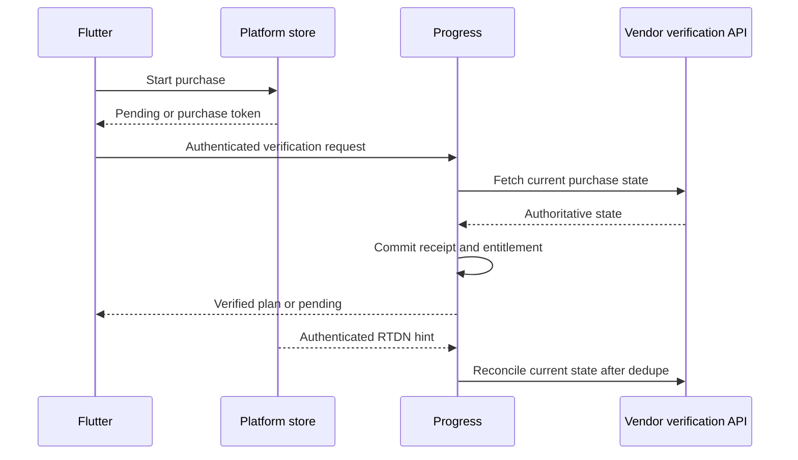

# Commercialization and billing contract

Current coursework baseline: core language learning always works without a purchase account; Super/Max/family/cancel screens are fixture previews. No live billing dependency or credentials were added. Live implementation is gated after core learning/progress, with its own acceptance task and platform access. Design owner is this document; no duplicate billing architecture file.

Primary later adapter: maintained Flutter [in_app_purchase](https://pub.dev/packages/in_app_purchase), platform Google Play first and StoreKit for iOS. Progress owns entitlements/purchase receipts; AI consumes an entitlement decision through Progress API rather than reading/writing its tables. Provider secrets/customer verification keys never reach Flutter. RevenueCat is optional only when integration effort and actual current price justify a reviewed change.

[Play backend guidance](https://developer.android.com/google/play/billing/backend) requires secure server purchase-state processing; [subscription lifecycle](https://developer.android.com/google/play/billing/lifecycle/subscriptions) treats current subscriptionsv2 state as authority. A client “purchase succeeded” message and RTDN alone are hints. Deduplicate messageId, verify authenticated notification transport, fetch purchase token state, verify package/product and user binding, then transactionally write receipt/entitlement. Never accept client price/expiry or acknowledge a pending purchase as active.

| State / event | Entitlement / UI / acceptance |
|---|---|
| purchase pending | Free remains available; show pending; no premium; pending→active only after verified vendor response |
| active / grace | Grant verified plan until authoritative boundary; test grace-specific policy without assuming all stores match |
| hold | Disable premium; preserve learner progress; offer manage-payment action |
| canceled | Keep access until paid expiry when vendor says active; cancellation does not mean immediate expiry |
| expired / revoked / refunded | Revoke premium idempotently; no fail-open; cached entitlements have short expiry |
| duplicate/out-of-order RTDN | Re-fetch current state; same logical grant/revocation once; older event cannot restore revoked access |
| reinstall / restore / user switch | Discover owned platform purchases, reverify and bind to correct account; never transfer another learner's entitlement |
| app killed after checkout | Backend reconciliation plus restore recovers; fixture reproduces without real checkout |
| vendor/queue outage | Keep free learning; show premium verification pending; safe retry, audit receipt and alert |

Local fake billing adapter must use `isSimulation`, fixtures for every state, no actual purchase token and no production entitlement write. Add platform sandbox/test purchase gates before real money. Play Console registration, Apple membership/signing and API eligibility are separate account costs, unverified here; do not include them in a zero-new-spend claim. No legal/licensing essay or production checkout is included.

OpenAPI has no enabled billing endpoints yet. Add versioned DTOs/tables through contract-owner review before implementation; this design does not silently expand service write scopes.
