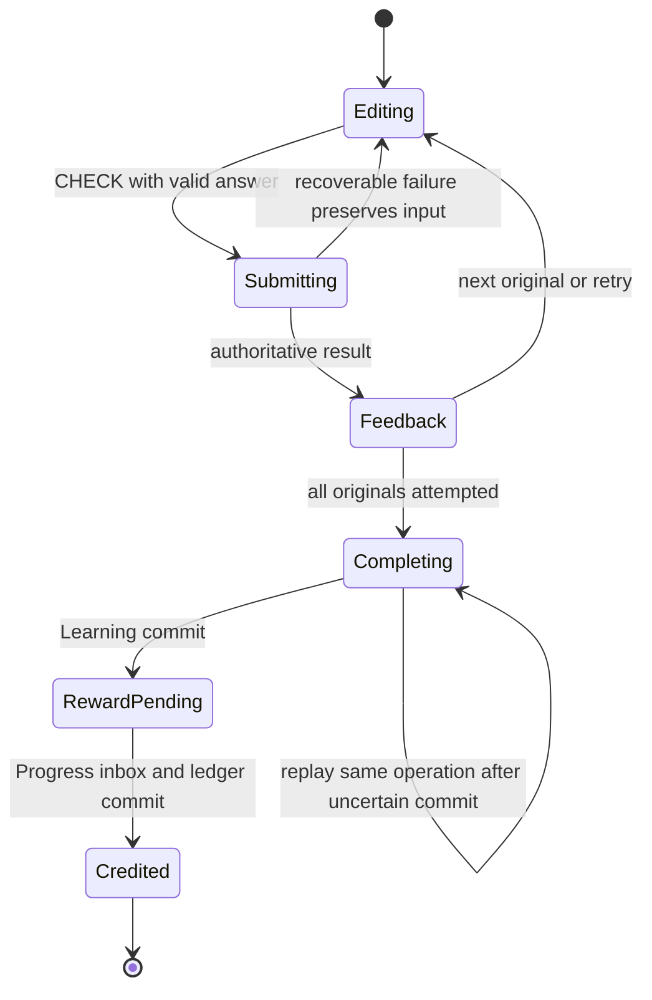

# Behavioral transition contracts

Normative extension of [SRS](SRS.md). Wire status enums remain in [OpenAPI](../api/openapi.yaml); local UI stages do not become invented server enums. Repositories return typed states/errors. Every asynchronous command carries an operation/session ID and rejects a stale generation after disposal/account switch. Nonsensitive input survives recoverable failure; logout removes private access immediately.

| Machine / current state | Trigger and guard | Next state / authoritative effect | Error / retry / test |
|---|---|---|---|
| auth: restoring | SDK restore then Account.get success | verified; load own profile, onboarding or enrolled route | offline cached user becomes cacheOnly; revoked becomes signedOut; AUTH-restore/user-switch |
| auth: signedOut | signIn or OAuth; one active attempt | submitting → verified | error returns signedOut/form input; cancel returns origin; never merge another account |
| auth: verified | logout/delete | stop mic/subscriptions, invalidate requests, clear private cache → signedOut | remote revoke/purge pending tracked by receipt; offline local logout immediate |
| signup/onboarding: editing | choose course/goal or back | persist choice/step; finish guest demo or account init | unavailable locale disabled; init replay once; kill-resume contract |
| placement: ready | start; no existing enrollment | active pinned ten items → evaluated → enrolled frontier | ≥8 first correct selects unit2; failure node1; no XP; repeat never regresses |
| lesson: idle/paused | start/resume with valid snapshot/online session | active pinned content+revision | expiry/retired version explicit repeat; no silent new bundle |
| answer: editing | CHECK; answer shape valid and no request in flight | submitting → feedback locked | timeout keeps same answer/key; conflict refreshes server revision; input still visible |
| lesson: feedback | Continue | next original; ordered mistakes; at most two retry passes; completing when originals attempted | app pause captures draft; no ordinary skip; media alternative authored |
| completion: completing | same-key commit success | completed receipt; Learning frontier changes once; reward pending | uncertain commit retains key; incomplete revision fails; doubles do not create another event |
| rewards: pending | valid owned completion event | applied inbox+ledger+day atomically → credited projection | consumer outage remains pending; duplicate returns old effect; stale hint triggers refetch |
| SRS review: due(stage n) | correct unassisted answer | stage n+1, next server due time | wrong/assisted resets; immutable answer ID prevents duplicate stage change |
| speaking: unavailable/idle | permission+capability+budget admit | requesting → recording/live ready | denied offers typed/shadowing; permanently denied offers OS settings; parental restriction handled |
| speaking: recording/listening | silence/stop/final/interruption | bounded upload or transcript → processing → feedback/playback | background/call/route switch clears mic; timeout/noise retry, score null; stale epoch ignored |
| live voice: RESERVED | mint once succeeds and client connects in allowed window | ACTIVE → CLOSED/EXPIRED; server reservation charged conservatively | ambiguous mint never remints same grant; cancellation clears queues; no client refund |
| listening: ready | play normal/slow/repeat | loading → playing → paused/ended | focus loss/call/device route pauses; missing/hash-invalid asset offers text alternative |
| offline sync: queued | verified same account+connectivity | sending → committed receipt or rejected command | exponential bounded retry; same ID; account switch blocks; corruption quarantines/export/repeat |
| subscription: none/pending | platform purchase begins | pending; no premium until server verified active | cancel/error retains free learning; test adapter cannot grant production entitlement |
| subscription: active/grace | current vendor state fetched after RTDN/restore | active/grace → hold/canceled/expired/refunded as vendor dictates | cancel retains access until authoritative expiry; hold/refund fail closed; duplicate webhook no second grant |
| notification: notAsked | user taps enable | OS prompt → granted/denied/restricted | no repeated prompt loop; disabled offers settings; device token rotation/deletion reconciled |

All completion/day decisions use server time; user clock, client XP, transcript match and provider model opinion are not authority. Temporal tests cover DST spring/fall, zone effectiveAt, late events and concurrent devices.

`lessonControllerProvider` currently implements local UI transitions; its in-memory draft is a mock capability. The durable/server transitions above are acceptance contracts for P3–P10, not claimed implementation.
